# History

## Versions
---

### v0 Ideation (Feb? 2011 - Apr 2011)

We discussed a lot of game ideas casually, without any intent to make any of them. Those ideas coalesced into Fantasy Battle Deluxe (Heart of Attack's original name), which we started taking detailed notes on. At this point I had no real programming experience, aside from some HTML and MIDI.

---

### v1 Fantasy Battle Micro (Apr 2011 - Feb 2012)

We decided the full scope of Fantasy Battle Deluxe was too much to take on, so we attempted a game whose sequel could be FBD. I created a rough prototype in YoYo GameMaker. It is interactive, but not really playable. You can see from the menus that the 8 faction themes are there, although barely any units are implemented.

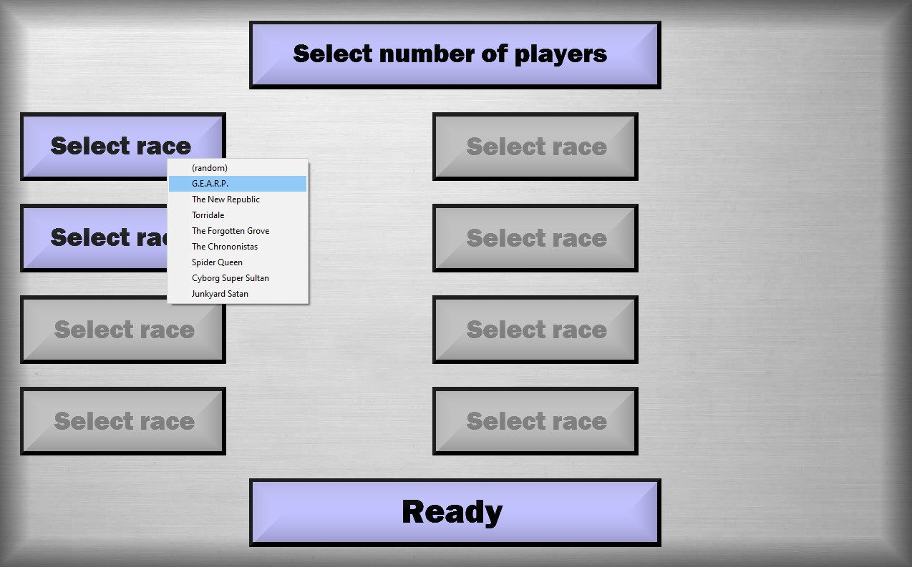
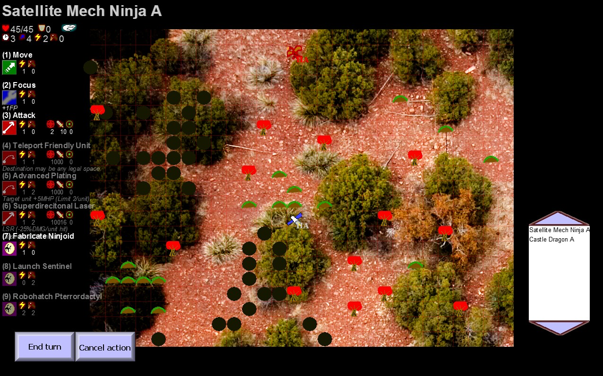
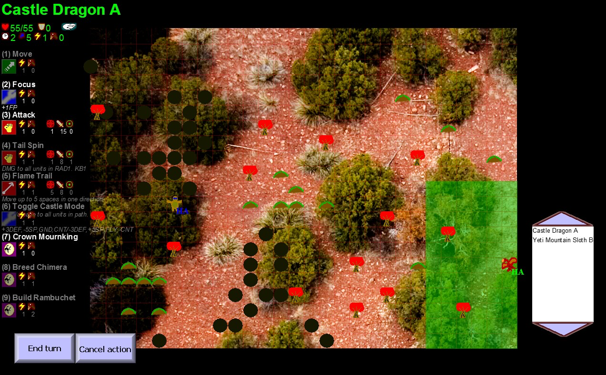

---

### v2 Fantasy Battle Deluxe (Feb 2012 - July 2013)

This was our initial deep dive into Unity. The maps were around the surface of a cube, which was both challenging to develop and play. The game menus were full of broken English text, attempting to create a "poorly translated Japanese game" feel. We learned a lot about development through trial and error, and regrouped with v3. v2 made it into a playable alpha state.

At the time, versions of this project were labelled by the date they were archived, like `07-01-2012`.

#### v2.03

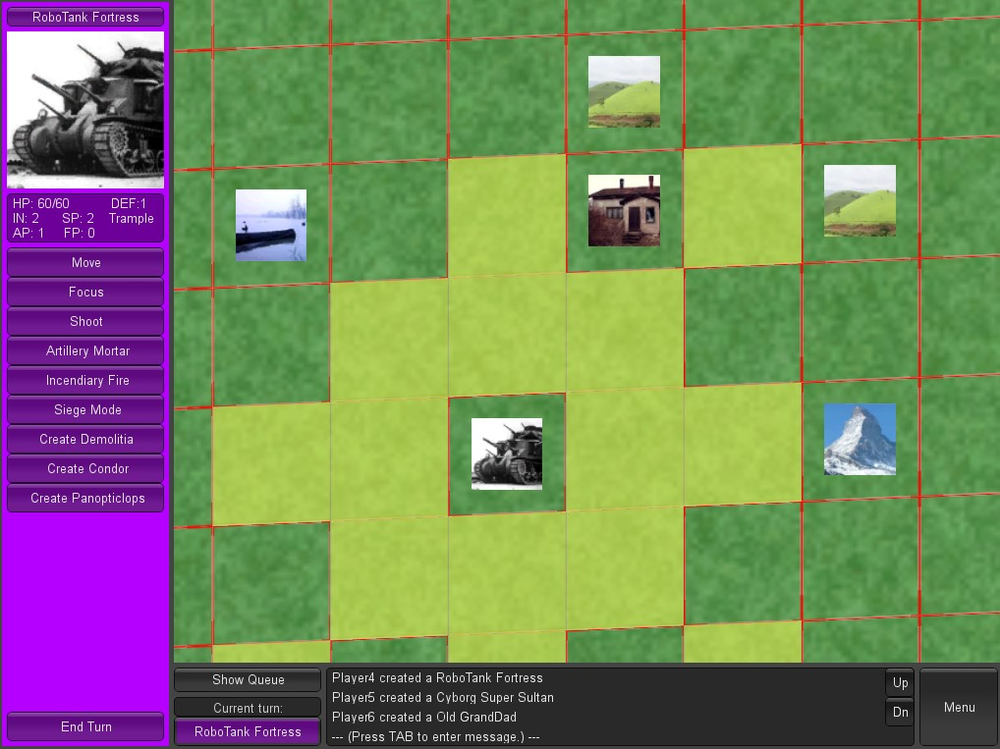

#### v2.13

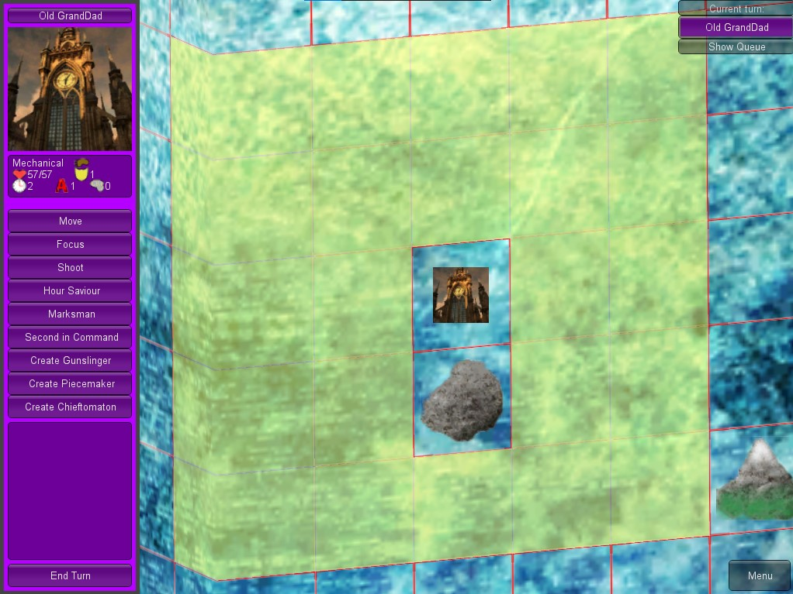
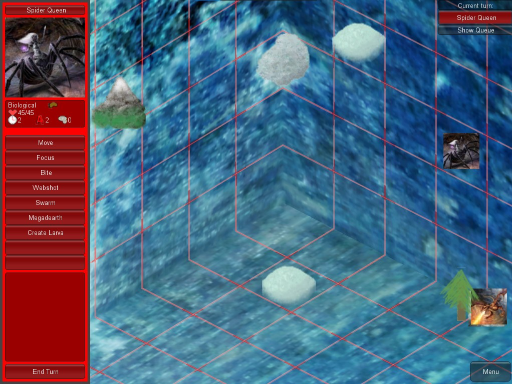

---

### v3.0 Fantasy Battle Cardboard (Aug 2013 - Dec 2013)

After doing some initial experiments with the 3D environment, we realized it was going to take a little while to understand the tools enough to build what we wanted.

So, while learning Unity, we also started playtesting mechanics with a tabletop version. I created a GUI app in Unity to help us keep track of in-game data, starting with the turn order (which is quite a complicated thing in Heart of Attack). This evolved into the game engine over time.

Since this app started as just the "Queue" in the game, each version was labelled `q1`, `q2`, etc. I will refer to these as `v3.01`, `v3.02`, etc. for consistency.

`v3.01` to `v3.10` are in the "Cardboard" phase.

#### v3.01

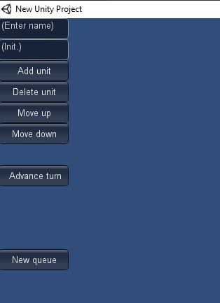
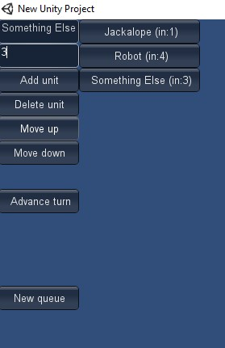

#### v3.09

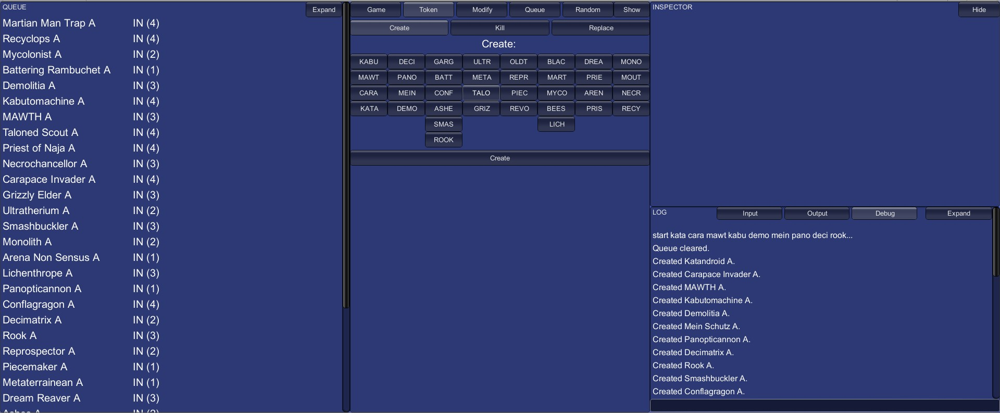

---

### v3.1 Fantasy Battle 2D (Dec 2013 - Jan 2014)

Eventually, a board UI was added to "the Queue app" and the cardboard was retired. This early board was completely 2D, built using button components. (This was years before Unity added a 2D engine.)

This stage also added a separate menu screen before the game itself. (This was also present in v2, but not in v3.0.)

`v3.11` to `v3.24` are in the 2D phase.

#### v3.17

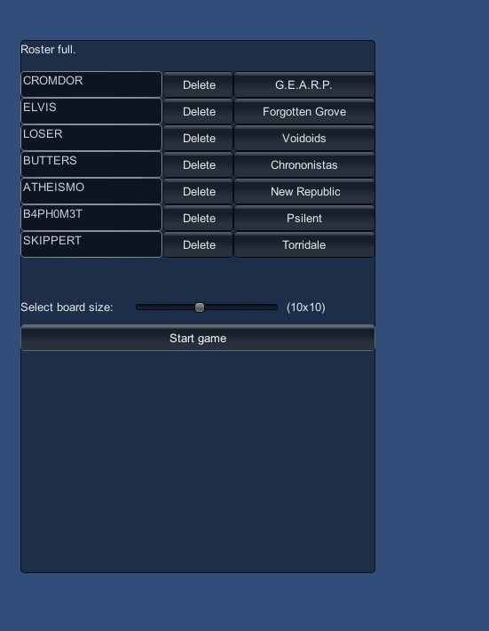

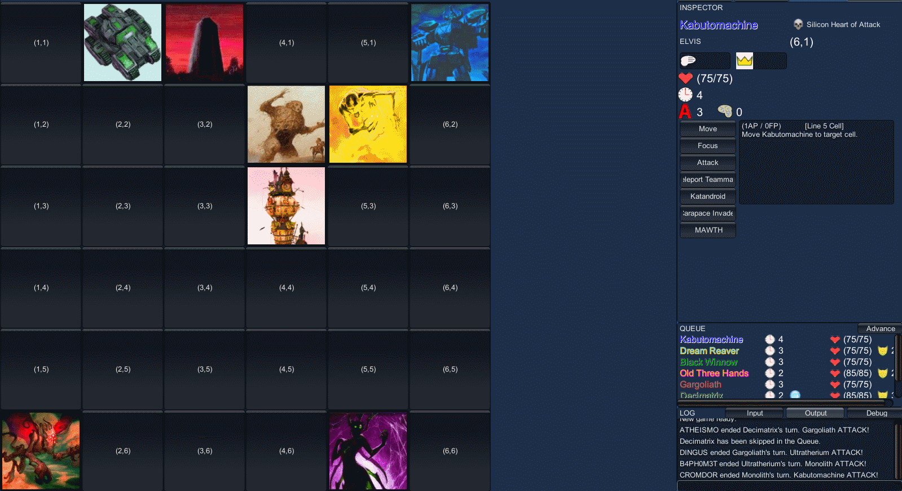

#### v3.23

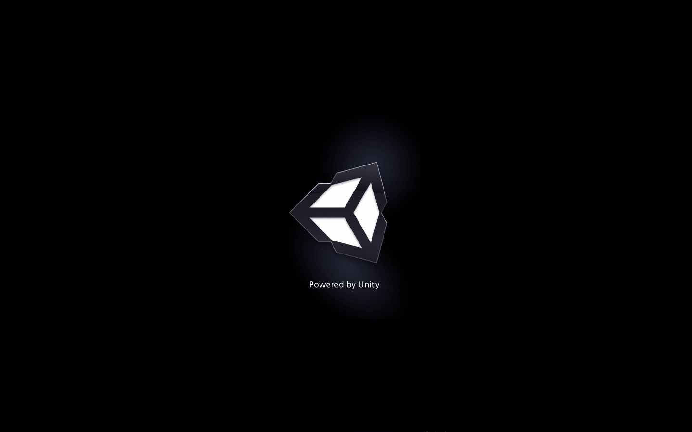

---

### v3.2 Fantasy Battle Isometric (Feb 2014 - Sep 2014)

We called the next iteration "isometric", but that is a bit of a misnomer. That term is usually applied to games like Starcraft which emulate 3D by showing 2D sprites from a diagonal perspective. What we were doing was really more akin to Parappa the Rapper, where a 3D engine is used to render a game in mixed 2D and 3D. The board was made out of 3D models in Unity's 3D engine, and the game tokens would move through 3D space. But the tokens themselves were 2D sprites that would pivot to always face the camera. This was a trick we came up with in v2, but turned out to work even better in this version, because with the cube board, a pivoting tokens would often dip into the board.

Some time during this phase we picked the name Heart of Attack, and beta testing with friends outside the design team started.

`v3.25` to `v3.45` are in the "Isometric" phase.

#### v3.31

#### v3.37

#### v3.44

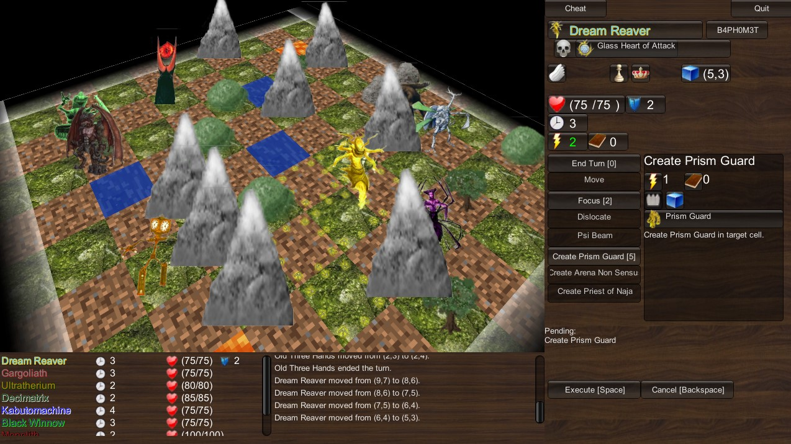

---

### v4 Heart of Attack (Sep 2014 - Oct 2014)

This was the point where I decided that there needed to be some kind of versioning system for the whole project's history, so v1 was given to GameMaker, v2 to the first cube-based Unity implementation, v3 to this codebase up to this point, and v4 starting "now".

These versions were all labeled `v4.01`, `v4.02`, etc. Most versions will either not compile, have runtime errors, or have incorrect game behavior that makes them unplayable.

---

### v5 Heart of Attack Rebuild (Oct 2014)

This looks like a rewrite that tried to implement as much game logic as possible in vanilla C#, outside of Unity. Some versions will start, but just log a lot of output. No GameObjects are put in the hierarchy. I don't think this ever got integrated with a GUI.

These versions were all labeled `v5.01`, `v5.02`, etc.

---

### v6 Heart of Attack Revisit (Mid 2017?)

I believe at some point much later I started to try a new implementation in F#, applying lots of lessons from a few years programming professionally. This didn't get very far, or integrated with a GUI.

---

## Requirements

|Version|Tools|
|-------|-----|
| v1 | YoYo GameMaker 8, GML |
| v2.00 - v2.14 | Unity3D 3.4.2, UnityScript |
| v2.20 - v3.06 | Unity3D 3.4.2, C# |
| v3.07 | Unity3D 4.0.1, C# |
| v3.08 | Unity3D 4.2.2, C# |
| v3.09 - v5.12 | Unity3D 4.3.1, C# |
| V6 | F# |
